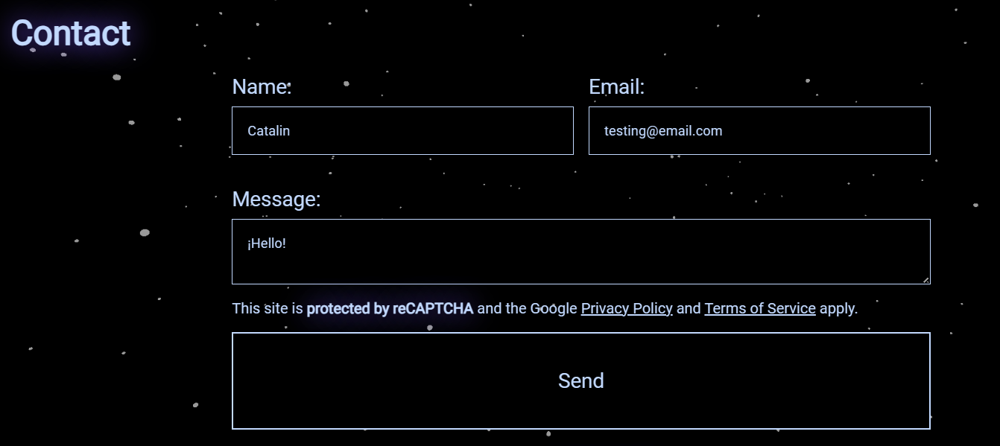
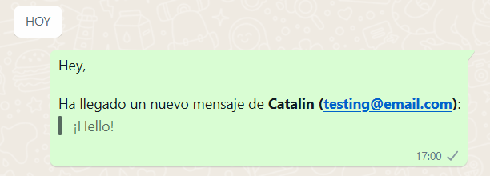
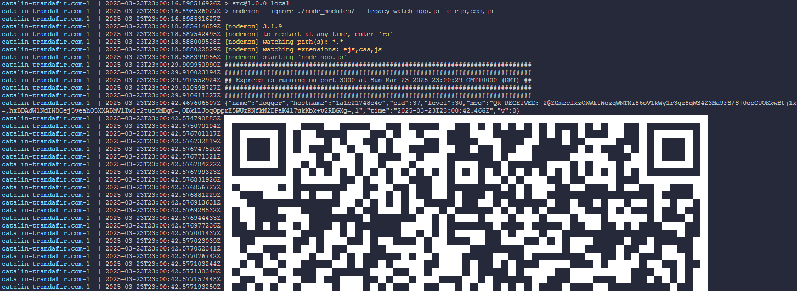

# catalin-trandafir.com

My Portfolio repository

## 📌 Index

1. 🚀 [Portfolio and First Web](#portfolio-and-first-web)
   - 🎨 [Portfolio](#portfolio)
     - 🌌 [Page Background](#page-background)
     - 📞 [Contact](#contact)
     - 🔒 [reCAPTCHA v3](#recaptcha-v3)
   - 🌐 [First Web](#first-web)
2. 🖥️ [Server](#server)
3. ⚙️ [Project Configuration](#project-configuration)
4. ▶️ [Run Project](#run-project)

---

## Portfolio and First Web

### Portfolio

I have 3 sections: My experience, projects, and a section to contact me.

#### Page Background

I'm using [three.js](https://threejs.org/) to display a 3D space in the background with white dots simulating stars.

#### Contact

For the contact section, I'm using [whatsapp-web.js](https://wwebjs.dev/) to send messages to a chat that I created on my WhatsApp account.

  


For the WhatsApp Web session, I use volumes on the server to maintain the same session even after restarting the container.

#### reCAPTCHA v3

For the contact form, I'm using [reCAPTCHA v3](https://developers.google.com/recaptcha/docs/v3) to prevent bots.

### First Web

This is just a simple HTML project that I made at school and adapted to work with Express. Nothing interesting to see, but if you're curious, there's a nice video in `Catalan` at the end of the index on [the site](https://catalin-trandafir.com/first-web/index) 🙄.

## Server

I'm using a `Raspberry Pi 4 Model B`, exposed using [Traefik](https://traefik.io/traefik/) as a reverse proxy and [Let's Encrypt](https://letsencrypt.org/) to get TLS certificates for the page.

I have a compose file for the server with all the necessary configurations.

## Project Configuration

Go to the root folder of the project you want to run (the portfolio).

```
cd portfolio
```

Now, you need the `.env` file with the reCAPTCHA keys and the WhatsApp chat ID.  
Check the [reCAPTCHA v3 web](https://developers.google.com/recaptcha/docs/) and the [WhatsAppWeb.js documentation](https://wwebjs.dev/guide/creating-your-bot/) for more information.

Make sure the `debian-dependencies-chrome-whatsappweb.txt` file has LF as the end-of-line sequence (it must have it).

## Run Project

If you configured everything correctly, you can start the project.

Simply executing `up -d` will build the image and generate the Docker container with all the necessary configurations.

```
docker compose up -d
```

Or, if you want to rebuild the image:

```
docker compose up -d --build
```

In the logs, you will have to wait a bit until you see a QR code.  


Scan that QR code with WhatsApp, and everything is ready to go!
